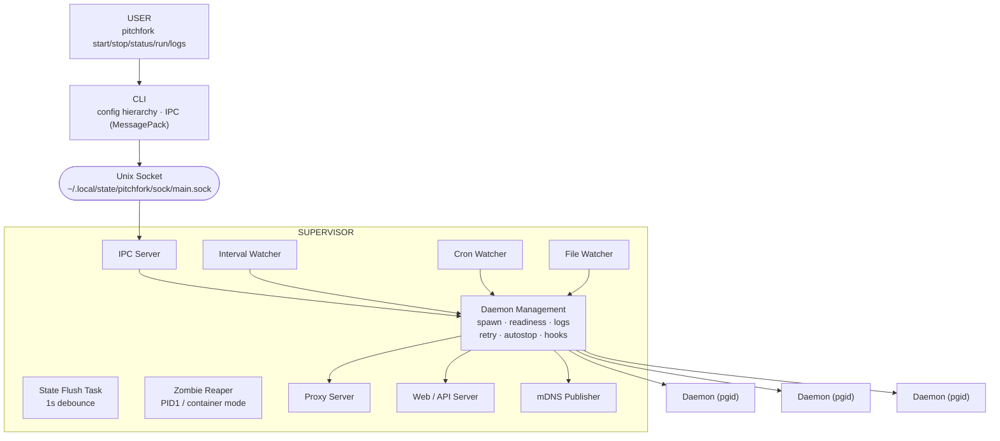

# Architecture

Technical overview of pitchfork's internal design.

## System Overview



## Components

| Component | Location | Purpose |
|-----------|----------|---------|
| CLI | `src/cli/` | User commands, config parsing, IPC client |
| Supervisor | `src/supervisor/` | Background daemon, process lifecycle, watchers |
| IPC | `src/ipc/` | Unix socket communication (MessagePack serialization) |
| State File | `src/state_file.rs` | Persistent state in TOML with file locking |
| Log Store | `src/log_store/` | SQLite-backed structured log storage (WAL mode) |
| Proxy | `src/proxy/` | HTTP/HTTPS reverse proxy with slug-based routing |
| Web/API | `src/web/` | Web UI and HTTP API server |

## Supervisor Module Layout

`src/supervisor/` is split into focused submodules:

| File | Responsibility |
|------|----------------|
| `mod.rs` | `Supervisor` struct, `start()`, signal handling, `close()`, orphan cleanup, zombie reaper (PID1 mode) |
| `lifecycle.rs` | `run()` / `run_once()` / `stop()`, port auto-bump, readiness loop, monitor task, `RunIdentity`, proxy env injection, `active_port` detection |
| `state.rs` | `UpsertDaemonOpts` builder, daemon/shell-dir state accessors |
| `watchers.rs` | Interval, cron, and file watchers; resource limits; log retention |
| `autostop.rs` | Shell-directory tracking, pending autostop scheduling, boot daemons |
| `retry.rs` | Background retry checker for `Errored` daemons |
| `hooks.rs` | `HookType` enum, `fire_hook`, `fire_output_hook` |
| `ipc_handlers.rs` | IPC accept loop and request dispatch |
| `pty.rs` | Unix PTY allocation via `openpty(3)` |

A single global `SUPERVISOR: Lazy<Supervisor>` singleton (`mod.rs`) is shared across all IPC handlers and background tasks.

## Supervisor Auto-Start

When you run a command like `pitchfork start`, the CLI:

1. Checks if the supervisor is running (by connecting to the socket)
2. If not, starts it in the background and waits for the socket to appear
3. Connects via Unix socket
4. Sends the command (MessagePack-encoded `IpcRequest`)

The supervisor runs independently and manages all daemons until shut down. CLI and supervisor exchange a version number on `connect` to detect protocol mismatches.

## Supervisor Startup (`start()`)

`Supervisor::start()` (`mod.rs`) bootstraps the background work graph in order:

1. Load persistent state from `state.toml`
2. Start IPC server on the Unix socket
3. Spawn background tasks:
   - `interval_watch()` (10s default, configurable via `general.interval`)
   - `cron_watch()` (cron check interval)
   - `signals()` (SIGTERM/SIGINT/SIGHUP/SIGQUIT/SIGALRM/SIGUSR1/SIGUSR2)
   - `daemon_file_watch()` (native + poll fallback, debounced)
   - `reap_zombies()` (Unix + container mode only)
   - `start_state_flush_task()` (1s debounce flusher)
   - Proxy server, web/API server, mDNS publisher (if enabled)
4. Start boot daemons (configured with `boot = true`) via `autostop::start_boot_daemons`

## Background Tasks

### Interval Watcher (default 10s)

Each tick performs:

- `refresh()` — refresh process list, update daemon liveness
- `check_retry()` — retry `Errored` daemons that have remaining attempts
- `process_pending_autostops()` — execute scheduled autostops whose debounce has elapsed
- `check_resource_limits()` — sample CPU/memory; restart daemons exceeding configured limits after consecutive violations
- `apply_log_retention()` — once per hour, prune logs by `logs.time_retention` / `logs.line_retention`

### Cron Watcher

- Scans daemons with a `cron_schedule`
- Triggers re-run according to `cron_retrigger` policy (`finish` / `always` / `success` / `fail`)
- Honors `cron_immediate` for first-run behavior

### File Watcher

`daemon_file_watch()` is a single background task, not part of `interval_watch`. It maintains a set of watched directories per daemon and restarts daemons when their `watch` globs change.

- **Modes**: `Native` (notify-rs recursive), `Poll`, `Auto` (default; tries native, falls back to poll per-directory)
- Debounces changes via `supervisor_file_watch_debounce()` (default 1s)
- Only restarts daemons in `Running` status; stopped daemons ignore changes
- Restart = `stop()` + `restart_delay` sleep + `run()`
- Syncs watch set as daemons start/stop (`watch_new_dirs` / `unwatch_removed_dirs`)

### State Flush Task (1s debounce)

Watches a `dirty: AtomicBool` flag on `StateFile` and writes to disk at most once per second. `close()` performs a final force-flush before shutting down IPC.

### Zombie Reaper (PID1 / Container Mode)

When pitchfork runs as PID1 (container mode), it installs a SIGCHLD handler and reaps orphaned child processes. On Linux it uses `waitid(WNOWAIT)` to peek before reaping, avoiding races with Tokio's `child.wait()`. On other Unix it stashes exit codes in `REAPED_STATUSES` so the monitor task can recover them when `child.wait()` returns `ECHILD`.

## Daemon States

| State | Meaning |
|-------|---------|
| `Waiting` | Reserved status for a daemon that is pending execution |
| `Running` | Spawned process; readiness is tracked separately by its monitor task |
| `Stopping` | Stop requested, SIGTERM sent, PID preserved for the monitor task |
| `Stopped` | Exited intentionally (via `stop()` or clean self-exit, code 0) |
| `Errored(i32)` | Exited with non-zero code; `-1` means unknown (e.g. killed by signal) |
| `Failed(String)` | Descriptive failure status carrying an error message |

`DaemonStatus` derives `strum::EnumIs`, so `is_stopped()` / `is_stopping()` / `is_running()` / `is_errored()` are available throughout the codebase.

`run_once()` persists `Running` immediately after `spawn()`. It does not use `Waiting` while readiness checks run; readiness is instead communicated through the per-start oneshot channel returned to the IPC caller. Its pre-spawn failures (such as port conflicts, shell parsing, or identity resolution) are returned as `IpcResponse::DaemonFailed`; process failures after spawn become `Errored(exit_code)` in the monitor task.

## State Persistence

Daemon state lives in `~/.local/state/pitchfork/state.toml`. Daemon keys are **qualified IDs** of the form `namespace/short_name` (for example `global/myapp`, or `legacy/myapp` for state migrated from the pre-namespace format).

```toml
[daemons."global/myapp"]
id = "global/myapp"
title = "My App"
status = "running"
pid = 12345
dir = "/path/to/project"
cmd = ["node", "server.js"]
run = "node server.js"
autostop = true
shell_pid = 98765
retry = 2
retry_count = 0
last_exit_success = true
ready_port = 8080
port = 8080
resolved_port = [8080]
active_port = 8080
slug = "myapp"
proxy = true
stop_signal = { signal = "SIGTERM", timeout = "5s" }
log_format = "json"
pty = false
mise = false
config_registered = true
cron_schedule = "0 */2 * * *"
cron_retrigger = "finish"

[disabled]
# BTreeSet of disabled DaemonIds

[shell_dirs]
# Map of shell_pid (as string) -> working_directory PathBuf
```

All writes go through `StateFile::write()`, which:

1. Acquires an `xx::fslock` file lock
2. Serializes to TOML and compares against the last snapshot (skips I/O if unchanged)
3. Writes to `state.toml.tmp` and atomically renames

On startup, legacy daemon keys (without a namespace) are automatically migrated to the `legacy/` namespace.

## Process Spawning (`run_once()`)

`Supervisor::run()` wraps `run_once()` with a retry loop (exponential backoff, capped at 3600s). `run_once()` performs a single spawn attempt:

1. **Port resolution** (`check_ports_available`): probe `0.0.0.0`, `127.0.0.1`, `::1` for each expected port. If `auto_bump` is enabled, bump all ports by the same offset to preserve relative spacing. Returns a structured `PortConflict` / `NoAvailablePort` IPC response on failure.
2. **Implicit port readiness**: if no other readiness check is configured and the first expected port is non-zero, use it as a TCP readiness probe. Skip port 0 (ephemeral).
3. **Standalone `ready_port` conflict check**: when `ready_port` is set without `expected_port`, detect if the port is already occupied to avoid false-positive readiness.
4. **Shell parsing**: split `general.shell` (default `sh -c`) into program + args. The run script is passed **verbatim** as the final argument (no `exec` prepend, which would break compound commands like `a && b`).
5. **mise wrapping**: if `mise = true`, wrap the command as `mise x -- <shell> <args> <run_script>`.
6. **PTY allocation** (Unix, optional): `openpty(3)`; both stdout and stderr connect to the slave PTY, read from the master.
7. **Command construction**:
   - `current_dir = opts.dir`
   - `PATH` reset to the original user PATH (so daemons find user tools)
   - Custom `env` from config applied first
   - Pitchfork metadata injected after user env: `PITCHFORK_DAEMON_ID`, `PITCHFORK_DAEMON_NAMESPACE`, `PITCHFORK_RETRY_COUNT`
   - `PORT` / `PORT0` / `PORT1` / ... set from resolved ports
   - Proxy env via `inject_proxy_env` (see Proxy Integration)
8. **`pre_exec` hook** (Unix): `setsid()` (so daemon PID == PGID, enabling process-group kills), optional `TIOCSCTTY` for PTY controlling terminal, and `apply_run_identity` for privilege switching.
9. **Spawn**, capture PID, `PROCS.refresh_pids`, upsert daemon as `Running`.
10. **Spawn monitor task** (see Readiness Detection).
11. If `wait_ready` is true, block on the readiness oneshot channel and return `DaemonReady` / `DaemonFailedWithCode`; otherwise return `DaemonStart` immediately.

## Privilege Switching (`RunIdentity`, Unix only)

`resolve_effective_run_identity()` decides which UID/GID the daemon runs as:

1. If the daemon configures `user`, resolve it (by name or numeric UID) to a `RunIdentity::Switch { uid, gid, username }`.
2. Else, if the supervisor runs as root and `SUDO_UID` / `SUDO_GID` are set, switch back to the sudo user.
3. Else, `RunIdentity::Inherit` (no switch).

Switching to a different user requires the supervisor to be root; otherwise it errors with a clear message. `apply_run_identity` runs in `pre_exec` after `setsid()` and calls `initgroups` / `setgid` / `setuid`.

## Readiness Detection

The monitor task spawned by `run_once()` drives readiness detection. It merges PTY master or stdout+stderr into a single `mpsc::channel<String>` and runs a `tokio::select! { biased; ... }` loop that evaluates branches in this fixed order:

1. **Process exit** (`exit_rx`) — pre-empts everything; a dead daemon is never marked ready.
2. **Output line** (`output_rx`) — parsed into structured logs, matched against `ready_output.pattern` (ANSI stripped) and the `on_output` hook.
3. **HTTP deadline / interval** — `GET ready_http.url`, accept if status matches `ready_http.status` (empty = any 2xx).
4. **Output deadline** — `ready_output.timeout` exhausted.
5. **HTTP interval tick** — periodic HTTP probe.
6. **Port deadline / interval** — TCP connect to `127.0.0.1:port`.
7. **Cmd respawn delay** — backoff before re-spawning a failed readiness command probe.
8. **Cmd probe result** — exit status of `ready_cmd.run` (success = ready).
9. **Cmd deadline** — `ready_cmd.timeout` exhausted.
10. **Delay timer** — `ready_delay` seconds; only marks ready when no other check is configured and the process is still alive.
11. **Log flush interval** — 100ms batch flush to SQLite.

| Method | Trigger | Default behavior |
|--------|---------|-------------------|
| Delay | Wait N seconds | Fires only when no other check is configured |
| Output | Regex matches stdout/stderr (ANSI stripped) | First match wins |
| HTTP | `GET url` returns accepted status | Empty `status` = any 2xx |
| Port | TCP connect to `127.0.0.1:port` succeeds | Implicit if no other check + non-zero expected port |
| Command | Shell command exits 0 | Respawned on non-zero with `ready_check_interval` backoff |
| on_output | Output line matches hook filter/regex | Fire-and-forget hook (not a readiness signal); debounced |

### Timeout and Exhaustion Semantics

Each check has an optional `timeout`. When it fires, that check is marked `*_exhausted` and stops polling. `any_ready_check_remaining()` returns true if any check is either unbounded (`timeout = None`) or not yet exhausted. Only when **all** checks are exhausted does the monitor:

- Send `Err(Some(124))` on the readiness channel
- `kill_process_group_async(daemon_pid, stop_signal, stop_timeout)`
- Break the loop

Checks with no timeout are unbounded and keep the daemon alive indefinitely until it exits or becomes ready.

### First-Ready Wins

The first check to succeed sets `ready_notified = true`, sends `Ok(())` on the readiness channel, fires `OnReady`, and clears all other deadlines/intervals. `active_port` detection is triggered at this point (if `has_port_config`).

## Port Management

### Auto-Bump

When `port.bump = true`, `check_ports_available` walks `bump_offset` from 0 to `max_bump_attempts`. All expected ports shift by the same offset to preserve relative spacing. If `ready_port` matches one of the expected ports, the same offset is applied to it. Port 0 (ephemeral) is skipped during availability checks.

### Active Port Detection

`detect_and_store_active_port(id, pid)` is a fire-and-forget background task triggered when a daemon becomes ready (or immediately if no readiness check is configured). It retries with exponential backoff (500ms / 1s / 2s / 4s, total 7.5s) to accommodate slow-starting runtimes (JVM, Node.js, Python).

Strategy:

1. Refresh process tree, collect the daemon PID and all descendants.
2. Find all listening ports owned by that set.
3. Prefer the configured `expected_port` if the process is actually listening on it.
4. Otherwise take the first port the OS reports (not the lowest — the lowest-numbered port is not necessarily the primary service port, e.g. HTTP vs metrics).
5. Write `active_port` to state, guarded against PID reuse (`d.pid == Some(pid)` before writing).

`active_port` is cleared when the monitor task observes process exit. Only daemons with port config or slug-targeted daemons (when proxy is enabled) run this task, avoiding wasted `listeners::get_all()` calls for port-less daemons.

## Process Termination

### `stop()` (single daemon)

1. Reject stopping the supervisor itself.
2. Set `status = Stopping` (**preserve PID** so the monitor task can fire `OnStop` / `OnExit`).
3. `PROCS.kill_process_group_async(pid, stop_signal, stop_timeout)` — kill the entire process group atomically (`killpg(pgid, signal)`). Daemon PID == PGID because of `setsid()` at spawn time.
4. Graceful escalation inside `kill_process_group`:
   - **Fast check**: poll every 10ms, up to 10 times
   - **Slow check**: poll every 50ms for the remaining `stop_timeout`
   - Default `stop_timeout` is 5s; `stop_signal` defaults to SIGTERM
   - If still alive after timeout: `killpg(pgid, SIGKILL)`
   - Zombie processes are detected and handled without unnecessary escalation
5. On success: `status = Stopped`, `pid = None`, `last_exit_success = Some(true)`, return `Ok`.
6. If the process was already dead: transition to `Stopped` (so the retry checker stops scheduling) and return `DaemonWasNotRunning`.
7. If kill failed and the process is still running: restore `Running` and return `DaemonStopFailed`.

### `close()` (supervisor shutdown)

1. Shut down IPC (stop accepting new requests).
2. Force-flush state.
3. Stop daemons in **dependency reverse order** (`compute_reverse_stop_order`), concurrent within each dependency layer.
4. Wait up to 5s for all monitor tasks to exit (`active_monitors` counter + `monitor_done` Notify), ensuring their drain and hook tasks have been registered.
5. Wait for all registered output-drain tasks concurrently with a single 7s timeout. Each drain task has its own 5s receiver deadline; remaining tasks are aborted after the overall timeout.
6. Wait for all hook tasks to complete (30s timeout per task).
7. Cancel proxy / web / mDNS tasks.

## Monitor Task Exit Path

When the spawned process exits, the monitor task performs cleanup in a specific order to handle concurrent `stop()` / `start()` races correctly:

1. **Acquire `MonitorGuard`** (RAII counter via `active_monitors` + `monitor_done` Notify) at the start of the monitor task. It covers every task exit path, so `close()` cannot observe `active_monitors == 0` before any drain or hook task has been registered.
2. **Snapshot `stop_intent_observed`** before any cleanup that could race with a concurrent `start()`. Computed as `was_stopped_before_cleanup || was_stopping_before_cleanup` from the pre-cleanup daemon state. This preserves the intentional-stop signal even if `start()` (e.g. from `pitchfork restart`) upserts a new PID with `Running` status during cleanup.
3. **Flush already-buffered logs** synchronously (not a full drain; the in-flight drain is deferred to step 6).
4. **Clear `active_port`** only if the daemon record still has this monitor's PID, checked while holding the state-file lock. A concurrent `start()` with a replacement PID keeps its new `active_port`.
5. **PID-takeover check + exit reason + hooks**: if `stop_intent_observed` is false and a new process has taken over (different PID, not `Stopping`/`Stopped`), spawn the background drain and return without updating state or firing hooks. Otherwise:
   - Combine the pre-cleanup snapshot with the current state to cover both race orders: `stop()` set `Stopping` before cleanup (`stop_intent_observed`), or `stop()` set `Stopped` during cleanup (`already_stopped`).
   - **Determine `exit_reason`**: `"stop"` (intentional), `"exit"` (clean self-exit), or `"fail"` (non-zero).
   - **Update state** unless `stop()` already did it or `stop_intent_observed` is true (avoid undoing a restart that upserted `Running` during cleanup).
   - **Fire hooks** based on `exit_reason`:
     - `"stop"` → `OnStop` + `OnExit`
     - `"exit"` → `OnExit`
     - `"fail"` with retries exhausted → `OnFail` + `OnExit`
     - `"fail"` with retries remaining → no hooks (retry loop handles it)
6. **Spawn and register a drain task** (`spawn_output_drain`) to drain remaining in-flight output for up to 5s. Each SQLite batch write is awaited before the next begins, and `close()` awaits the registered task with its single 7s shutdown budget. The monitor itself does not wait, so concurrent `start()` remains unblocked.

## Hooks

`HookType` (`src/supervisor/hooks.rs`): `OnReady`, `OnFail`, `OnRetry`, `OnStop`, `OnExit`. Hooks are fire-and-forget `tokio::spawn` tasks registered in `SUPERVISOR.hook_tasks` so `close()` can await them (30s timeout).

| Hook | When fired |
|------|------------|
| `OnReady` | Any readiness check succeeds |
| `OnRetry` | Retry loop schedules another attempt (`run()` backoff, `retry.rs` background checker) |
| `OnStop` | Process exit caused by `stop()` |
| `OnExit` | Any process exit (after `OnStop` or `OnFail` if applicable) |
| `OnFail` | Process exited with non-zero code **and** retries are exhausted |

The separate `on_output` hook is **not** a lifecycle hook. It fires when an output line matches a configured filter/regex, debounced by `debounce_duration()`. It runs in parallel with readiness detection and never marks a daemon ready.

Hook scripts receive the daemon's working directory, retry count, environment, and extra env vars (`PITCHFORK_EXIT_CODE`, `PITCHFORK_EXIT_REASON` for exit hooks).

## Logging

Output is captured from PTY master (merged) or stdout+stderr (merged into one channel), parsed via `log_store::parse` with the configured `log_format`, and written to a SQLite store in WAL mode.

- **Batching**: up to 100 lines or 100ms interval, flushed via `spawn_blocking` to avoid blocking the async runtime.
- **Synchronous flush before readiness**: when `ready_output` matches, the current batch is flushed and awaited so `collect_startup_logs` sees the triggering line.
- **Drain on exit**: after process exit, already-buffered logs are flushed synchronously; remaining in-flight output is drained in a registered background task (`spawn_output_drain`) for up to 5s. Batches are written sequentially, and `close()` awaits all registered drains concurrently with one 7s timeout; normal monitor cleanup and concurrent `start()` do not wait for the drain.
- **Retention**: `interval_watch` runs `apply_log_retention` hourly, pruning by `logs.time_retention` and `logs.line_retention`.

## Proxy Integration

When `proxy.enable = true`, pitchfork runs an HTTP/HTTPS reverse proxy that routes `<slug>.<tld>` to the daemon's `active_port`.

`inject_proxy_env(cmd, slug)` sets:

- `HOST=127.0.0.1` — only for slug-targeted daemons in non-LAN mode (so daemons bind to loopback)
- `PITCHFORK_URL` — the daemon's public proxy URL (`http(s)://<slug>.<tld>[:port]`)
- `NODE_EXTRA_CA_CERTS` — path to the pitchfork CA cert (when HTTPS is enabled)
- `__VITE_ADDITIONAL_SERVER_ALLOWED_HOSTS` — `.<tld>` for Vite host allowlisting
- `PITCHFORK_LAN=1` — when LAN mode is active

In LAN mode, `HOST` is **not** forced so daemons can bind to `0.0.0.0` and be reachable from the network. mDNS publisher advertises daemons on the local network when LAN mode is enabled.

## Resource Limits

`check_resource_limits()` (in `interval_watch`) samples CPU and memory per daemon. A daemon is restarted only after **consecutive** samples exceed the configured `memory_limit` / `cpu_limit` threshold, avoiding flapping from transient spikes.

## IPC Responses

Daemon-related `IpcResponse` variants:

| Variant | Meaning |
|---------|---------|
| `DaemonStart { daemon }` | Spawned, not waiting for readiness |
| `DaemonReady { daemon }` | Spawned and readiness confirmed |
| `DaemonAlreadyRunning` | Another instance is running (use `--force` to stop first) |
| `DaemonFailed { error }` | Pre-spawn setup failure (port/shell/identity) |
| `DaemonFailedWithCode { exit_code }` | Process exited before becoming ready |
| `PortConflict { port, process, pid }` | Expected port is in use by another process |
| `NoAvailablePort { start_port, attempts }` | Auto-bump exhausted |
| `DaemonStopFailed { error }` | `stop()` could not kill the process |
| `DaemonWasNotRunning` | PID recorded but process already dead |
| `DaemonNotRunning` | Daemon has no PID |
| `DaemonNotFound` | No such daemon |
| `Ok` | Stop succeeded |
